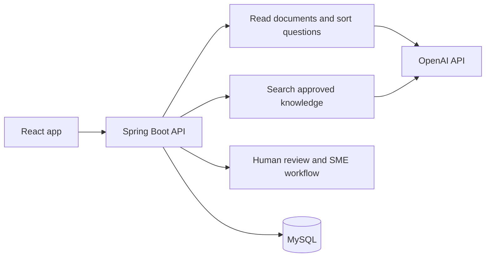

# Customer Forms Hub

> A Java and Spring Boot application for handling customer security and compliance questionnaires.

Customer-facing teams often need to answer long questionnaires quickly. The information can be spread across policy documents, and some answers need a specialist to check them. This project brings that work into one review flow.

AI helps sort questions and find useful internal sources. A reviewer can then accept an answer, change it, or send the question to an SME or AE. The system does not approve or send AI answers by itself.

[Frontend repository](https://github.com/alisonzzzz-y/customer-form-hub-frontend) · [中文说明](README.zh-CN.md)

<!--
SCREENSHOT NOTE
The screenshots belong in the frontend README because it is the main project entry point.
Link to the frontend README from here rather than repeating the same images.
-->

## What the application does

```text
Create ticket
  -> Upload an Excel or Word questionnaire
  -> Read the questions and group them by department
  -> Find relevant approved knowledge sources
  -> Accept, edit, or send open questions to an SME or AE
  -> Complete a final review
  -> Export the response
```

The React frontend provides the main workspace, knowledge-base screens, reports, and an AI Performance page for managers.

## Deployment

The deployed demo is split into four small services:

| Part | Service | Responsibility |
|---|---|---|
| Frontend | Vercel | Hosts the React application |
| Backend API | Render | Runs this Spring Boot API and document workflow |
| Database | Railway MySQL | Stores tickets, questions, knowledge entries, and review data |
| AI services | OpenAI API | Classifies questions and creates embeddings for knowledge search |

Local development can use any MySQL 8 or later database through the environment variables shown below.

[Open the live demo](https://customer-form-hub.vercel.app/)

## My contribution

I built this backend independently, including the API, document processing, AI integration, data model, review workflow, retrieval check, and automated tests.

## How AI is used

### Sort incoming questions

The application uses `gpt-4o-mini` to place uploaded questions into departments such as InfoSec, Legal, HR, Finance, and ESG. It checks the returned structure before saving it to the workflow.

### Find useful knowledge

Knowledge-base content is prepared with `text-embedding-3-small`. When a reviewer opens a question, the backend searches approved knowledge entries and returns the three closest matches. Each match keeps its source identifier, so the reviewer can see where it came from.

The technical implementation uses stored embeddings and cosine similarity. This is an internal search aid, not a system that writes and approves final answers on its own.

### Keep people in control

A reviewer can accept a suggestion unchanged, edit it before approval, send it to an SME, or ask an AE for clarification. The AI Performance page shows the latest result for each AI-assisted question.

## A small retrieval check

The project includes a versioned synthetic test set at `src/main/resources/ai-performance/retrieval-benchmark-v1.json`. It checks whether the expected knowledge source appears in the first one or three search results.

| Result from the local demo run | Value |
|---|---:|
| Test cases | 12 |
| Expected source ranked first | 100% |
| Expected source in the first three | 100% |
| Failed or skipped cases | 0 |

This is an initial smoke test with synthetic data. It checks that retrieval works as expected after changes. It does not measure live answer quality or prove that the AI can answer customer questions independently.

Run the check against your configured knowledge base:

```bash
AI_EVALUATION_RUN=true ./mvnw spring-boot:run
```

## Main parts of the system



## Tech used

| Area | Tools |
|---|---|
| Backend | Java 21, Spring Boot 3.5, Spring Web |
| Data | Spring Data JPA, Hibernate, MySQL |
| AI | OpenAI REST API, `gpt-4o-mini`, `text-embedding-3-small` |
| Files | Apache POI for Excel and Word files |
| Tests and checks | JUnit 5, Mockito, H2, GitHub Actions |

## Run locally

### You need

- Java 21
- MySQL 8 or later
- An OpenAI Platform API key

Create a local database:

```sql
CREATE DATABASE formhub;
```

Set the local configuration:

```bash
export OPENAI_API_KEY="your-key"
export DB_URL="jdbc:mysql://localhost:3306/formhub"
export DB_USERNAME="root"
export DB_PASSWORD="your-password"
```

Start the API:

```bash
./mvnw spring-boot:run
```

The API is available at `http://localhost:8080/api` by default. If that port is already in use, set `PORT` and use the same address in the frontend's `VITE_API_BASE` setting.

## Useful API endpoints

| What it is for | Endpoint |
|---|---|
| List tickets | `GET /api/tickets` |
| Import a questionnaire | `POST /api/questionnaire/import?ticketId={id}` |
| Search the knowledge base | `POST /api/knowledge-base/search` |
| Save an approved answer | `POST /api/final-answers` |
| Ask an SME for help | `POST /api/sme-requests` |
| Read AI review results | `GET /api/ai-performance/review-summary` |
| Read retrieval test runs | `GET /api/ai-performance/retrieval-runs` |

## Checks

```bash
./mvnw clean verify
```

The tests cover search scoring, source links, review outcomes, reopened questions, empty states, file upload handling, and read compatibility. They also include MockMvc API integration tests for ticket status changes, AI-to-AE escalation, department-level SME dispatch, and retrieval evaluation results. These tests use an isolated H2 database and do not call OpenAI. GitHub Actions runs the Maven checks on pushes and pull requests to `main`.

## Demo data and current limits

On an empty database, the application creates demo tickets, knowledge entries, SME requests, and eight demo AI review results: five accepted, two edited, and one escalated. They are only there to make the interface easier to explore.

This project does not yet include a full login and permission system, database migrations with Flyway, a complete event history, or verified email delivery. Those are future improvements, not features being claimed here.
